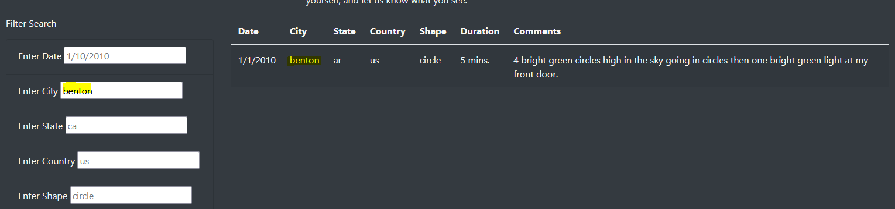
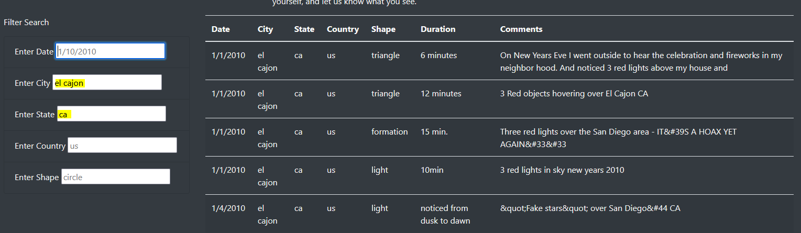

# UFOs

## Overview of Project

### Purpose

The client, Dana, is wanting to display data about UFO sightings. A website was created using HTML, Bootstrap, CSS, and Javascript that displays data in tabular format and allows for custom filtering.

## Results

There is a list of filters to the left of the table (pictured below).

The user can enter a value in any of the fields, and once they either click out of it or press "Enter", the table will automatically update to display the data that matches, if applicable.

The user can enter multiple values to improve the desired specificity.

## Summary
One drawback with this website's design is that it is difficult to identify unique values in each of the columns that are being filtered. The user either has to manually find a value that exists within the table to know that it has data, or they have to take a shot in the dark.

It would be beneficial to explore options with dropdowns in the filters so that users can directly select the values that they wish.
The next improvement would be allowing the filter dropdowns to automatically update with the data that exists within the other filter parameters.