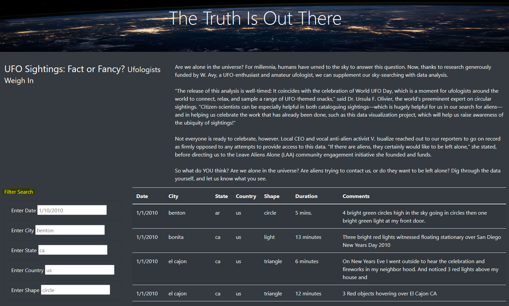

# UFOs

## Overview of Project

### Purpose

The client, Dana, is wanting to display data about UFO sightings. A website was created using HTML, Bootstrap, CSS, and Javascript that displays data in tabular format and allows for custom filtering.

## Results

There is a list of filters to the left of the table (pictured below).

## Summary